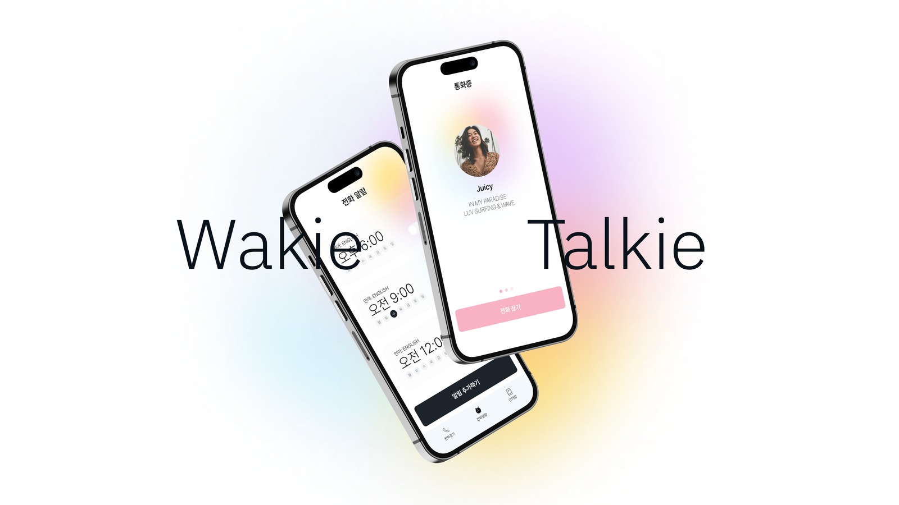
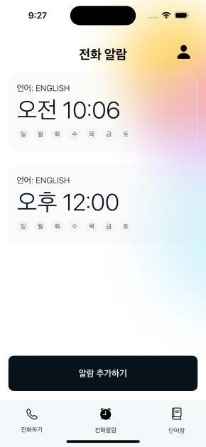
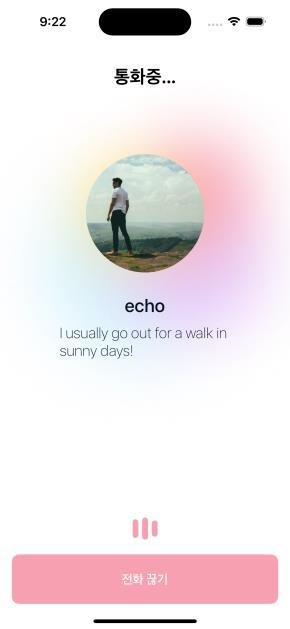
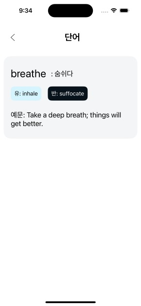
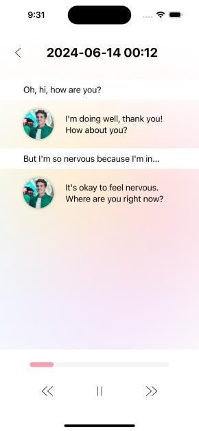
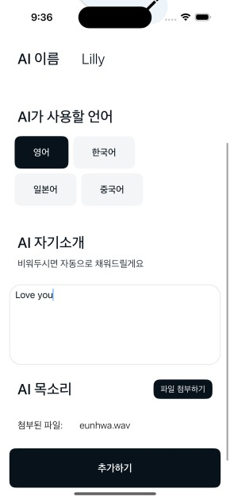
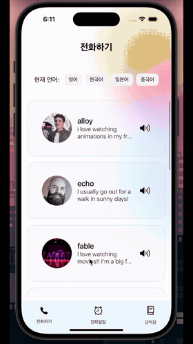
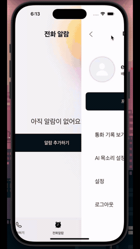
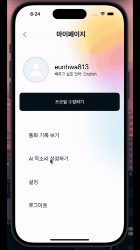
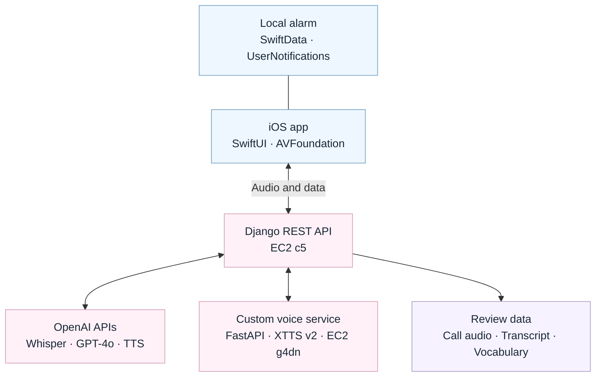

  

<h1 align="center">Wakie-Talkie</h1>

<strong>Wake up. Speak up.</strong>

알람으로 시작해, AI와 대화하고, 나만의 단어장으로 이어지는 외국어 학습 앱.

  
  
  
  
  

  <a href="#features">Features</a> ·
  <a href="docs/DEMO.md">Demo</a> ·
  <a href="#architecture">Architecture</a> ·
  <a href="#repositories">Repositories</a> ·
  <a href="docs/DEVELOPMENT.md">Development</a>

## About

**Wakie-Talkie는 아침 알람을 외국어 대화의 시작점으로 만드는 iOS 앱입니다.** 원하는 시간과 AI 프로필을 선택하면 로컬 알림으로 대화를 시작할 시간을 알려줍니다. 앱에서 AI와 음성으로 대화하고, 통화가 끝난 뒤에는 대화 기록과 자동 생성된 단어장으로 학습을 이어갈 수 있습니다.

2024년 중앙대학교 캡스톤디자인 프로젝트로 개발했으며, 공학학술제에서 시연했습니다. 이 저장소에서 서비스 화면, 시스템 설계, 개발 문서와 각 구현 저장소를 함께 볼 수 있습니다.

## Features

<table>
  <tr>
    <th width="20%">Wake-up alarm</th>
    <th width="20%">AI conversation</th>
    <th width="20%">Vocabulary</th>
    <th width="20%">Call history</th>
    <th width="20%">Custom voice</th>
  </tr>
  <tr>
    <td></td>
    <td></td>
    <td></td>
    <td></td>
    <td></td>
  </tr>
</table>

| Feature | Experience |
| :--- | :--- |
| **알람 기반 대화** | 시간·반복 요일·언어·AI 프로필을 설정하고, 알림을 받은 뒤 앱에서 대화를 시작합니다. |
| **AI 음성 통화** | 언어별 프로필을 선택해 대화합니다. 발화 감지, 응답 대기, 음성 재생 상태를 화면에 표시합니다. |
| **자동 단어장** | AI 답변에서 단어를 추출하고 한국어 뜻·유의어·반의어·예문을 생성합니다. 지난 단어장도 조회할 수 있습니다. |
| **통화 기록** | 사용자와 AI의 발화를 텍스트로 확인하고, 순서대로 합친 대화 음성을 다시 재생합니다. |
| **커스텀 음성** | 참조 음성을 업로드해 커스텀 프로필을 만들고, 해당 음성을 활용한 TTS로 대화합니다. |
| **다국어 선택** | 영어·한국어·일본어·중국어를 선택하는 UI와 언어별 AI 프로필을 제공합니다. |

  
  &nbsp;&nbsp;
  
  &nbsp;&nbsp;
  

<em>공학학술제 발표 자료의 실제 앱 시연 · GIF는 무음입니다.</em>

<a href="docs/DEMO.md"><strong>전체 화면과 6개 시연 보기 →</strong></a>

## Architecture

**iOS 앱, 대화·데이터 API, GPU 음성 합성 서버를 분리해 연결했습니다.** 알람은 기기 내부에서 관리하고, 대화 요청은 Django를 거쳐 음성 인식·응답 생성·음성 합성으로 이어집니다.

### Engineering highlights

- **발화 종료 감지와 대화 상태 연결** — `AVAudioRecorder`의 입력 레벨을 주기적으로 확인해 발화 구간을 나누고, 녹음·요청·재생 상태를 SwiftUI에 연결했습니다.
- **STT → LLM → TTS 파이프라인** — 녹음 파일을 multipart 요청으로 전달하고, 대화 문맥을 포함한 답변 생성과 음성 합성을 거쳐 앱에서 재생합니다. 기본 음성과 커스텀 음성을 같은 통화 흐름에서 사용합니다.
- **기기 내부 알람 관리** — SwiftData에 알람을 저장하고 다음 활성 알람을 계산해 `UNUserNotificationCenter`에 등록합니다. 알림과 앱 내 수신 화면을 연결했습니다.
- **GPU 기반 커스텀 음성 합성** — Coqui XTTS v2에 업로드한 `speaker_wav`를 전달하는 추론 API를 구현했습니다. 일반 API 서버와 GPU 작업을 분리했습니다.
- **대화 데이터의 재사용** — 발화별 오디오를 순서대로 합쳐 통화 기록을 만들고, AI 응답 텍스트로 단어장을 생성해 대화와 복습을 연결했습니다.

[음성 처리·알람 설계·API·데이터 흐름 자세히 보기 →](docs/ARCHITECTURE.md)

## Tech stack

| Layer | Technologies |
| :--- | :--- |
| iOS | Swift · SwiftUI · AVFoundation · SwiftData · UserNotifications |
| API | Python · Django · Django REST Framework |
| Speech & conversation | Whisper API · GPT-4o · OpenAI TTS · Coqui XTTS v2 |
| Custom TTS service | FastAPI · PyTorch · Uvicorn |
| Audio processing | PCM/WAV · pydub · FFmpeg |
| Infrastructure | AWS EC2 c5 / g4dn — 프로젝트 당시 서버 구성 |

## Repositories

**이 저장소가 프로젝트의 시작점입니다.** 구현 코드는 역할에 따라 아래 저장소에서 관리합니다.

| Repository | Responsibility | Entry point |
| :--- | :--- | :--- |
| [Wakie-Talkie-frontend](https://github.com/Wakie-Talkie/Wakie-Talkie-frontend) | iOS UI, 음성 입출력, 로컬 알람, API 연결 | `Wakie-Talkie.xcodeproj` · `main` |
| [Wakie-Talkie-Backend](https://github.com/Wakie-Talkie/Wakie-Talkie-Backend) | 사용자·AI 프로필, 통화 처리, 기록·단어장 API | `manage.py` · `main` |
| [Wakie-Talkie-TTS](https://github.com/Wakie-Talkie/Wakie-Talkie-TTS/tree/Wakie-Talkie-use-TTS) | Coqui TTS 기반 참조 음성 등록·음성 합성 API | `custom_TTS.py` · **`Wakie-Talkie-use-TTS`** |
| [Wakie-Talkie-server](https://github.com/Wakie-Talkie/Wakie-Talkie-server) | 별도 보관된 Django 기본 데이터 API 코드 | Private · 개발 참고용 |

TTS 저장소는 [coqui-ai/TTS](https://github.com/coqui-ai/TTS)의 fork입니다. 프로젝트용 API는 위의 전용 브랜치에 있습니다. `server` 저장소는 접근 권한이 필요하며, 아래 개발 안내는 최종 매뉴얼에 명시된 **frontend + Backend + TTS** 구성을 기준으로 합니다.

## Development

| Document | Contents |
| :--- | :--- |
| [Architecture](docs/ARCHITECTURE.md) | 음성 처리 시퀀스, 발화 구간화, 알람 생명주기, 데이터 구조와 API |
| [Development guide](docs/DEVELOPMENT.md) | 저장소·브랜치 선택, 개발 환경, 실행 절차, 재현 시 확인할 부분 |
| [Demo gallery](docs/DEMO.md) | 주요 화면과 실제 기기 시연 6종 |
| [Project notes & credits](docs/PROJECT.md) | 기획 변화, 구현 범위, 팀, 자료와 오픈소스 출처 |

프로젝트는 **2024년 캡스톤 프로토타입**입니다. 음성 대화는 발화 단위의 요청·응답 방식이며, 알림을 받은 뒤 앱에서 대화를 시작합니다. 종료된 앱에서의 자동 통화 진입과 현재 환경에서의 실행 조건은 [개발 안내](docs/DEVELOPMENT.md)에 정리했습니다.

## Team

**중앙대학교 2024-1 캡스톤디자인 · Team 4**

강지인 · [이은화](https://github.com/Ontheway-01) · 최동우

앱 기획부터 클라이언트, 서버, AI 음성 처리 연동까지 함께 개발했습니다. 프로젝트 당시 보고서와 시연 자료를 바탕으로 이 페이지를 구성했습니다.

Wakie-Talkie · Wake up. Speak up.

