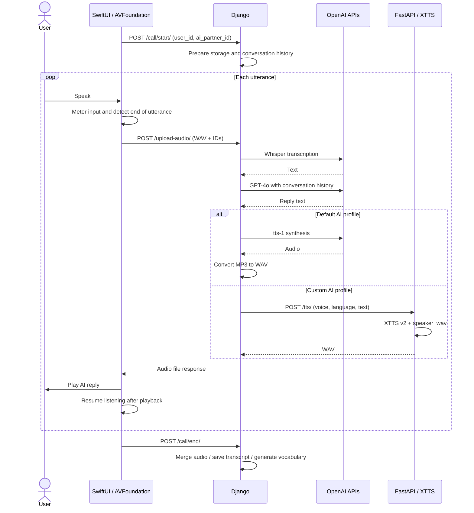
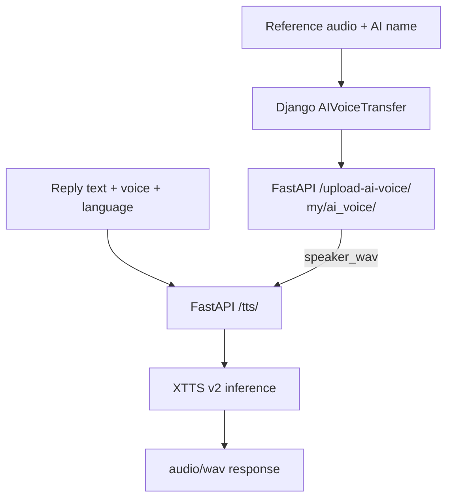

# Architecture

[← Project overview](../README.md) · [Development](DEVELOPMENT.md) · [Demo](DEMO.md)

Wakie-Talkie의 핵심은 **기기에서 발생하는 발화와 알람 이벤트를 서버의 음성 처리·대화 기록·복습 데이터에 연결하는 것**입니다. 이 문서는 2024년 구현 코드와 최종 보고서를 기준으로 설명합니다. 참조 코드의 버전은 [Project notes](PROJECT.md#source-snapshot)에 고정했습니다.

## 1. System boundaries

| Component | Owns | Exchanges |
| :--- | :--- | :--- |
| iOS client | 알람 설정, 음성 녹음·재생, 화면 상태, 로컬 알림 | 발화 오디오, 사용자·AI ID, 프로필·기록·단어장 |
| Django backend | AI 프로필, 대화 문맥, 음성 처리 조합, 통화 결과 저장 | OpenAI API 요청, 커스텀 TTS 요청, 파일 응답 |
| FastAPI TTS service | 참조 음성 파일, XTTS v2 모델, 합성된 WAV | `voice`, `language`, `text` → `audio/wav` |
| Local alarm store | 시간, 반복 요일, 활성 상태, 언어, AI 선택 | 다음 알람과 앱 내 수신 화면에 필요한 상태 |

보고서의 배포 구성은 Django를 EC2 c5에, GPU 합성을 EC2 g4dn에 분리한 형태입니다. 코드의 localhost 주소는 각 서비스의 실행 환경에 맞게 설정해야 합니다.

## 2. A conversation turn

**사용자의 한 발화를 WAV로 전송한 뒤, 생성된 AI 음성을 돌려받아 재생합니다.**

### Utterance segmentation

`AudioRecordingFunc.swift`는 `AVAudioRecorder`의 metering 값을 사용합니다.

| Parameter | Value in source | Purpose |
| :--- | :--- | :--- |
| 녹음 포맷 | Linear PCM, 44.1 kHz, mono, 16 bit | 발화 파일 생성 |
| 입력 레벨 확인 주기 | 0.1 s | 현재 음성 입력 상태 갱신 |
| 무음 판단 기준 | `averagePower < -27.0` dB | 발화가 멈춘 구간 감지 |
| 종료 대기 시간 | 1.5 s | 기준 이하 입력이 지속되면 녹음 종료 |

입력 레벨이 임계값 이상으로 돌아오면 무음 시작 시간을 갱신합니다. 일정 시간 동안 기준 이하를 유지하면 녹음을 종료하고, 파일을 서버로 전달하는 다음 단계로 넘어갑니다. 이 값들은 소스의 설정값이며, 소음 환경별 정확도를 측정한 결과는 아닙니다.

### UI and playback

음성 입력 레벨, 응답 생성 대기, 재생 상태를 서로 다른 UI로 표시합니다. `AudioEngineFunc.swift`는 `AVAudioPlayerNode`로 오디오 파일이나 PCM 버퍼를 예약하고, 재생 완료 콜백을 통해 상태를 바꿉니다. 이 연결은 AI가 말하는 동안 사용자 녹음이 중복 시작되는 상황을 다루는 데 필요합니다.

서버는 발화 파일을 받은 뒤 STT·대화 생성·TTS를 순서대로 처리합니다. 따라서 현재 구조의 응답 시간에는 발화 종료 대기, 업로드, 각 API 처리, 오디오 전달 시간이 포함됩니다. 코드에 단계별 시간 로그가 있지만, 이를 근거로 특정 지연 시간이나 개선율을 제시하지는 않습니다.

**Source:** [AudioRecordingFunc.swift](https://github.com/Wakie-Talkie/Wakie-Talkie-frontend/blob/9f378c46ed31952ff88808b678abcfe119de336b/Wakie-Talkie/View/CallTabViews/Functions/AudioRecordingFunc.swift) · [AudioEngineFunc.swift](https://github.com/Wakie-Talkie/Wakie-Talkie-frontend/blob/9f378c46ed31952ff88808b678abcfe119de336b/Wakie-Talkie/View/CallTabViews/Functions/AudioEngineFunc.swift) · [AudioFileDataUploader.swift](https://github.com/Wakie-Talkie/Wakie-Talkie-frontend/blob/9f378c46ed31952ff88808b678abcfe119de336b/Wakie-Talkie/ViewModel/AudioFileDataUploader.swift) · [call_view.py](https://github.com/Wakie-Talkie/Wakie-Talkie-Backend/blob/e9eb23757f80cea89c4c86bc61d9f0ad4a653b16/wakietalkie/call_view.py)

## 3. Local alarm lifecycle

**알람 일정은 기기에 저장하고, 다음 활성 알람을 기준으로 로컬 알림을 예약합니다.**

1. 알람의 시간·반복 요일·활성 상태·언어·AI 프로필을 저장합니다.
2. 활성 알람 중 다음 발생 시점이 가장 가까운 알람을 계산합니다.
3. 알람 변경 시 기존 pending notification을 정리하고 새 일정을 등록합니다.
4. 앱에서 수신 상태를 반영하면 선택된 AI와 연결된 화면으로 이동합니다.

이 설계는 알람 일정 관리에 서버 push를 요구하지 않습니다. AI 대화에는 네트워크 연결이 필요합니다. 최종 보고서는 앱이 완전히 종료된 경우의 자동 화면 전환 제한을 기록하고 있으며, 당시 시연은 foreground/background 상태 유지를 전제로 설명했습니다.

**Source:** [AlarmModel.swift](https://github.com/Wakie-Talkie/Wakie-Talkie-frontend/blob/9f378c46ed31952ff88808b678abcfe119de336b/Wakie-Talkie/Model/AlarmModel.swift) · [AlarmManager.swift](https://github.com/Wakie-Talkie/Wakie-Talkie-frontend/blob/9f378c46ed31952ff88808b678abcfe119de336b/Wakie-Talkie/Utilities/AlarmManager.swift) · [AlarmTimer.swift](https://github.com/Wakie-Talkie/Wakie-Talkie-frontend/blob/9f378c46ed31952ff88808b678abcfe119de336b/Wakie-Talkie/Utilities/AlarmTimer.swift)

## 4. Custom voice synthesis

**등록된 참조 음성을 XTTS v2의 `speaker_wav` 입력으로 사용합니다.**

등록 과정에서는 앱이 전달한 음성 파일과 AI 이름을 Django가 TTS 서비스로 전달합니다. TTS 서비스는 이름으로 참조 파일을 찾아, 대화 중 생성된 텍스트를 해당 음성의 특성을 반영한 WAV로 합성합니다.

프로젝트용 `custom_TTS.py`에는 모델 로드, CPU/CUDA 선택, 참조 음성 저장·조회, 합성 API와 `zh` → `zh-cn` 언어 코드 변환이 구현되어 있습니다. 이 경로에서 사용한 방식은 **사전 학습 모델에 참조 음성을 제공하는 추론**입니다. 커스텀 API 구현과 앱 연동이 프로젝트의 개발 범위이며, XTTS 모델 자체를 처음부터 학습한 것으로 설명하지 않습니다.

**Source:** [custom_TTS.py — project branch](https://github.com/Wakie-Talkie/Wakie-Talkie-TTS/blob/9d5a6e7bb79a0d1ec9c9bb66d71723a19a763854/custom_TTS.py) · [ai_view.py](https://github.com/Wakie-Talkie/Wakie-Talkie-Backend/blob/e9eb23757f80cea89c4c86bc61d9f0ad4a653b16/wakietalkie/ai_view.py)

## 5. From conversation to review

통화 종료 시 두 종류의 산출물을 만듭니다.

| Output | Processing | Storage |
| :--- | :--- | :--- |
| 통화 기록 | 사용자·AI 오디오를 발화 번호로 정렬해 교차 병합하고 대화 텍스트 저장 | `Recording`: 오디오·텍스트 파일 경로, 사용자·AI ID, 날짜, 언어, 재생 길이 |
| 단어장 | AI 응답 텍스트를 모아 GPT에 단어·뜻·유의어·반의어·예문 생성 요청 | `VocabList`: 사용자·통화 ID, 날짜, `word_list` JSON 필드 |

AI 프로필과 언어는 별도 모델로 관리합니다. 모델의 ID 연결 중 일부는 `IntegerField`이며, 모든 관계가 데이터베이스 외래 키로 강제되는 구조는 아닙니다. 단어장 생성은 JSON 형식을 요청하는 프롬프트 기반이므로, 생성 결과의 파싱·스키마 검증은 재현 시 확인할 항목입니다.

**Source:** [models.py](https://github.com/Wakie-Talkie/Wakie-Talkie-Backend/blob/e9eb23757f80cea89c4c86bc61d9f0ad4a653b16/wakietalkie/models.py) · [call_view.py](https://github.com/Wakie-Talkie/Wakie-Talkie-Backend/blob/e9eb23757f80cea89c4c86bc61d9f0ad4a653b16/wakietalkie/call_view.py)

## 6. API map

최종 백엔드 소스의 주요 경로입니다. 전체 URL 정의는 [urls.py](https://github.com/Wakie-Talkie/Wakie-Talkie-Backend/blob/e9eb23757f80cea89c4c86bc61d9f0ad4a653b16/djangoProject6/urls.py)에서 확인할 수 있습니다.

| Service | Method / Path | Role |
| :--- | :--- | :--- |
| Django | `POST /call/start/` | 대화 문맥과 파일 저장 경로 준비 |
| Django | `POST /upload-audio/` | 발화 수신 → STT → GPT → TTS → 오디오 응답 |
| Django | `POST /call/end/` | 음성 병합, 기록 저장, 단어장 생성 |
| Django | `GET /ai-users/` | AI 프로필 조회 |
| Django | `GET /ai-users/language/{language_id}/` | 언어별 프로필 조회 |
| Django | `POST /ai-users/upload-ai-voice/` | 참조 음성을 TTS 서버에 전달 |
| Django | `POST /ai-users/get-sample-audio/` | AI 프로필의 샘플 음성 요청 |
| Django | `GET /recordings/user/{user_id}/` | 사용자별 통화 기록 조회 |
| Django | `GET /recordings/text/{pk}` | 대화 텍스트 조회 |
| Django | `GET /recordings/record/{pk}` | 통화 음성 조회 |
| Django | `GET /vocab-lists/recent/{user_id}/` | 최근 단어장 조회 |
| FastAPI | `POST /upload-ai-voice/` | 참조 음성 저장 |
| FastAPI | `POST /tts/` | 참조 음성과 텍스트로 WAV 생성 |

## 7. Prototype boundaries

완성된 기능과 이후 확장 작업을 구분하기 위한 기록입니다.

- **대화 세션 분리:** `conversation_history`와 저장 경로 등이 프로세스 전역 상태입니다. 다중 사용자 동시 통화로 확장하려면 세션별 상태·파일 격리가 필요합니다.
- **음성 대화 방식:** 발화 단위 파일 업로드와 응답 재생 구조입니다. 양방향 스트리밍이나 끼어들기 처리는 별도 설계가 필요합니다.
- **알람 생명주기:** 로컬 알림 예약과 앱 내 화면 전환을 구분해야 합니다. 앱 종료 상태, 알림 권한, 반복 알람의 경계 조건을 기기에서 확인해야 합니다.
- **오류와 데이터 검증:** API 실패·중단 시 복구, 출력 JSON 검증, 사용자별 기록 접근 제어는 운영 환경으로 확장할 때 보완할 부분입니다.

[← Project overview](../README.md)
