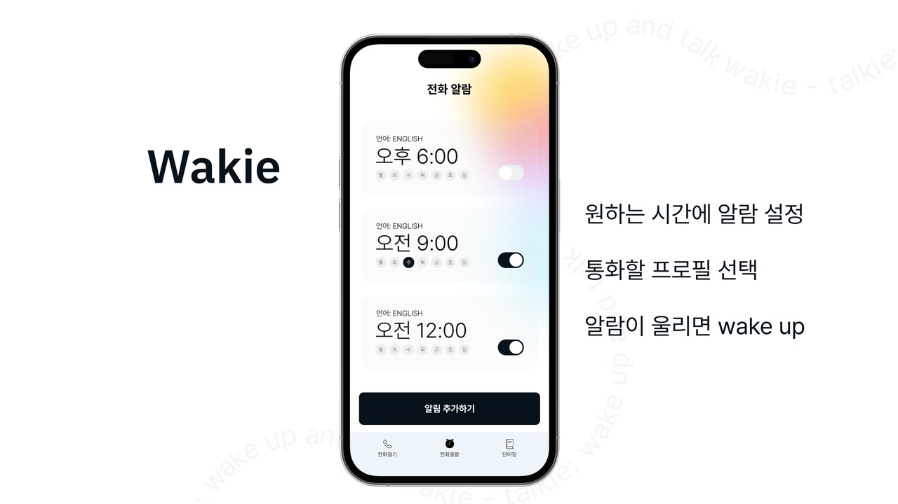
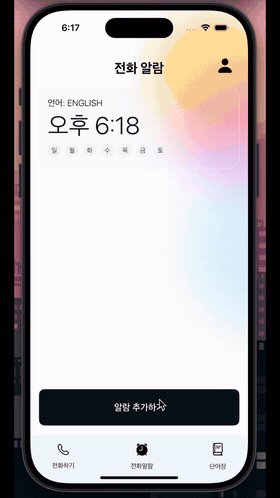
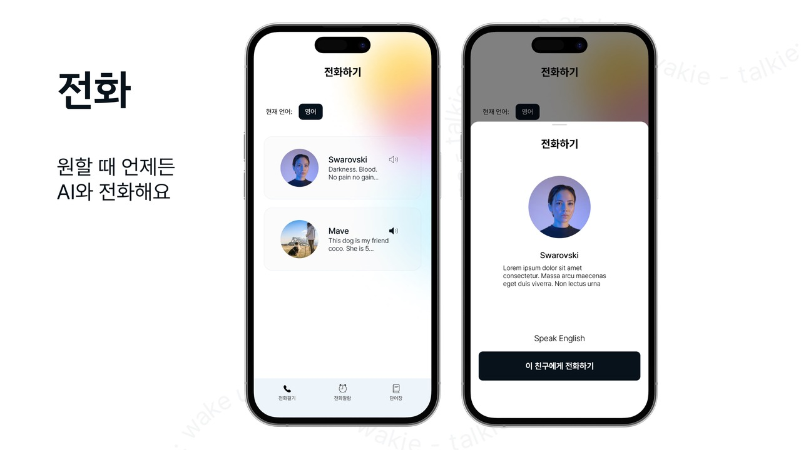
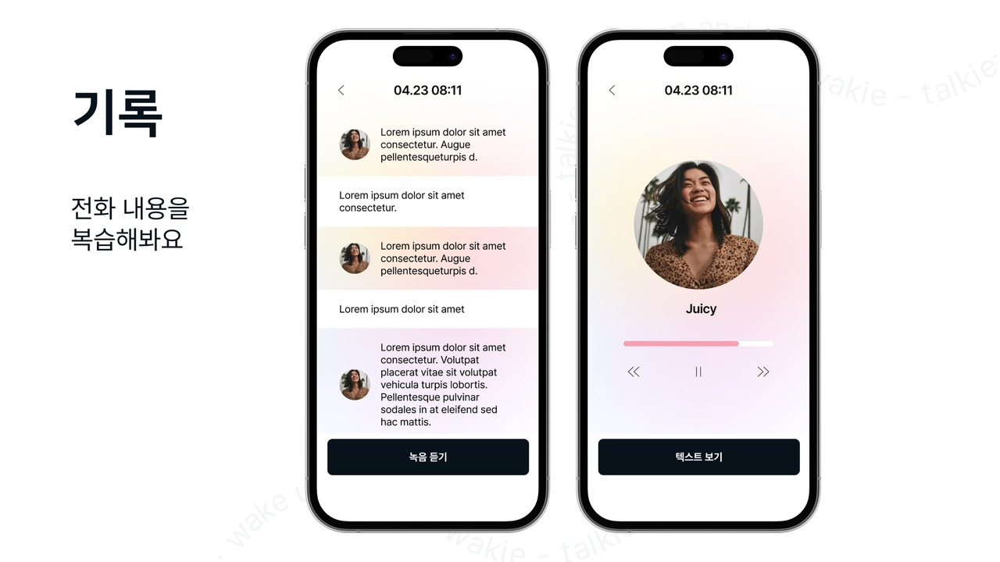
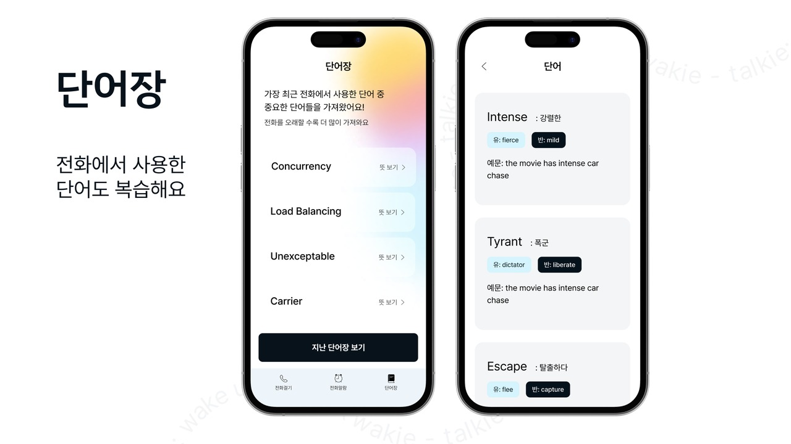
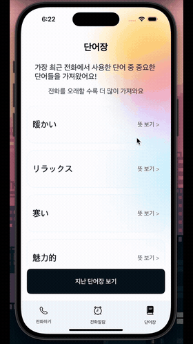
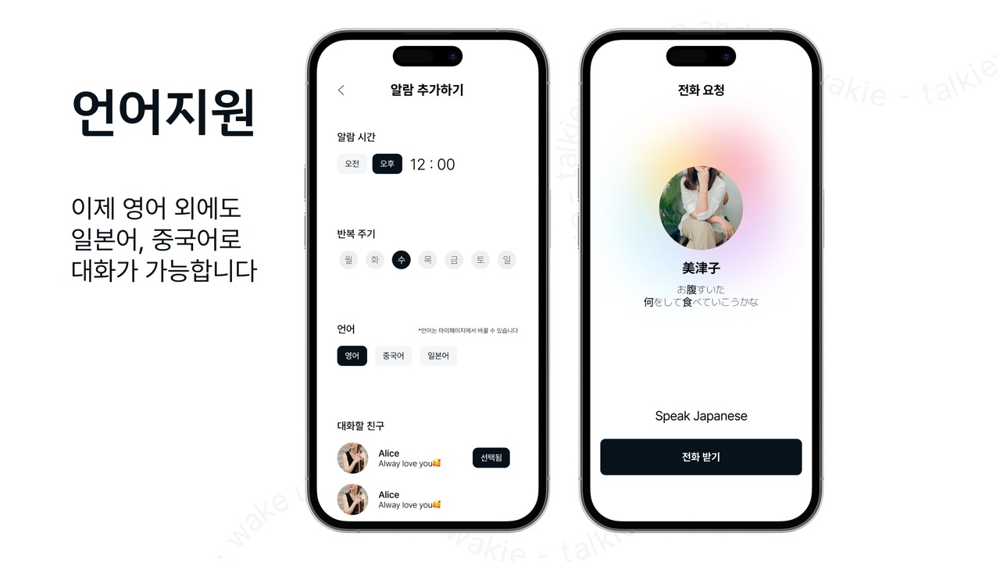
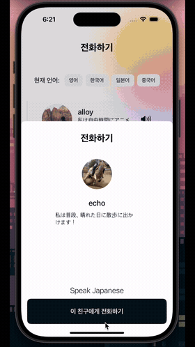
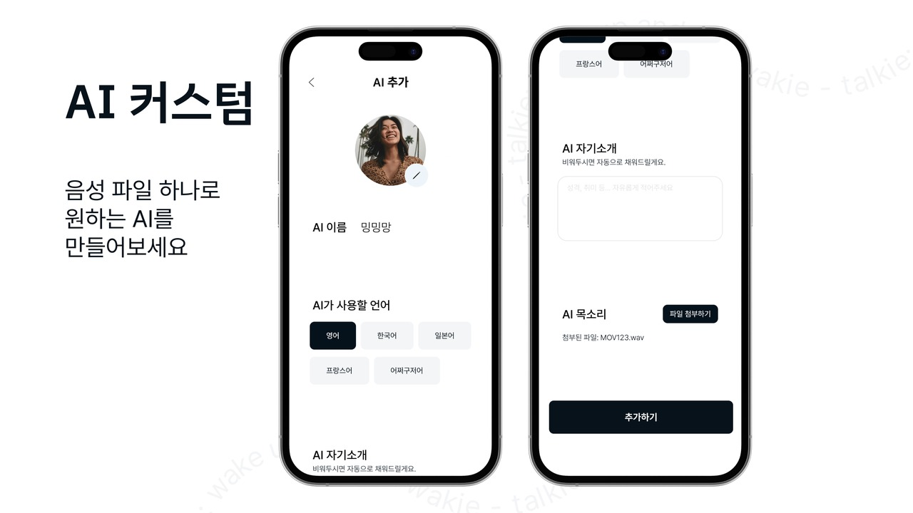

# Demo gallery

[← Project overview](../README.md) · [Architecture](ARCHITECTURE.md)

**아래 화면은 프로젝트의 최종 발표 자료, GIF는 공학학술제 발표 자료에 포함된 실제 앱 시연입니다.** 화면 설명용 이미지와 시연 영상의 촬영 시점이 달라 프로필·문구·데이터에 차이가 있습니다. GIF는 무음이며, 원본 영상을 프레임 수와 해상도를 줄여 변환했습니다.

## 01 · Wake-up alarm

**원하는 시간에 AI와 대화를 시작하도록 알람을 설정합니다.** 시간, 반복 요일, 언어, 대화할 AI를 선택하고 로컬 알림을 받은 뒤 앱에서 대화를 이어갑니다.

구현: SwiftData · UserNotifications · 다음 활성 알람 계산 · 앱 내 수신 화면 연결

## 02 · AI conversation

**프로필을 선택하면 AI와 음성으로 대화할 수 있습니다.** 입력 중인 음성의 레벨과 AI 응답 대기 상태를 화면에서 구분합니다.

구현: AVFoundation · 발화 종료 감지 · multipart 오디오 업로드 · STT → GPT → TTS

## 03 · Call history

**지난 통화를 텍스트와 음성으로 다시 확인합니다.** 사용자와 AI의 발화를 구분해 표시하고, 대화 음성을 순서대로 재생합니다.

구현: 발화별 파일 정렬·병합 · 대화 텍스트 저장 · 기록 조회 API · 오디오 플레이어

## 04 · Vocabulary

**방금 나눈 대화가 복습할 단어장이 됩니다.** AI 응답에서 뽑은 단어와 한국어 뜻, 유의어, 반의어, 예문을 확인합니다.

구현: AI 발화 텍스트 추출 · GPT JSON 형식 출력 요청 · 통화별 단어장 저장·조회

## 05 · Language selection

**선택한 언어에 맞는 AI 프로필로 대화합니다.** 앱에는 영어·한국어·일본어·중국어를 선택하는 화면이 구현되어 있습니다.

구현: 언어별 프로필 조회 · 음성 처리 언어 연결 · 커스텀 TTS 언어 코드 처리

## 06 · Custom voice

**업로드한 참조 음성으로 나만의 AI 프로필을 만듭니다.** 이름, 언어, 소개와 음성 파일을 등록한 뒤 해당 프로필로 대화합니다.

구현: 참조 음성 업로드 · Django–FastAPI 연결 · XTTS v2 `speaker_wav` 추론

[← Project overview](../README.md)
